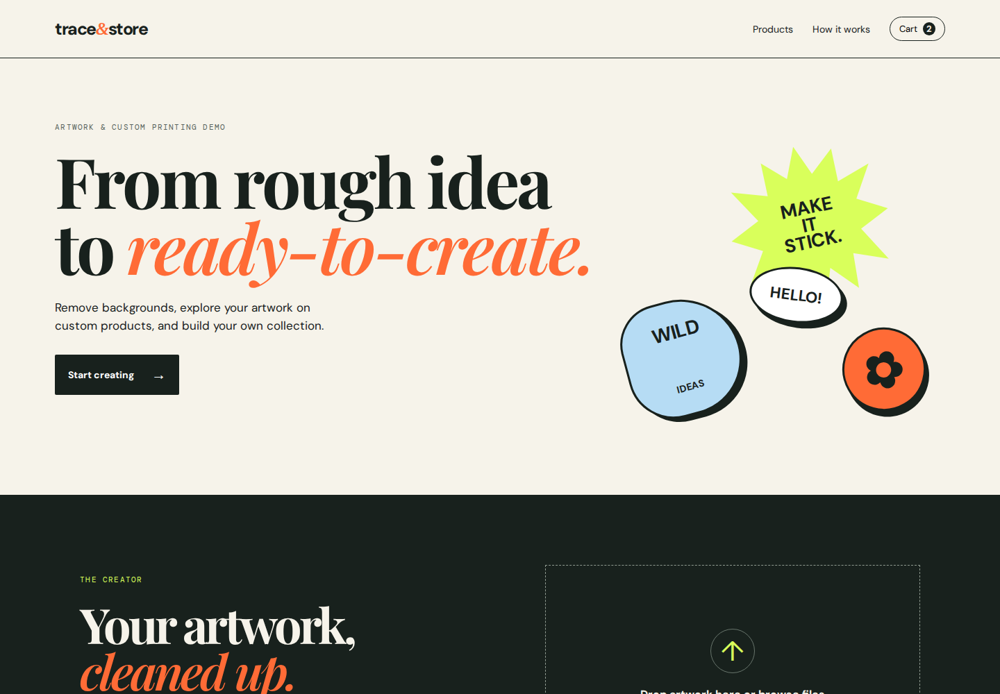
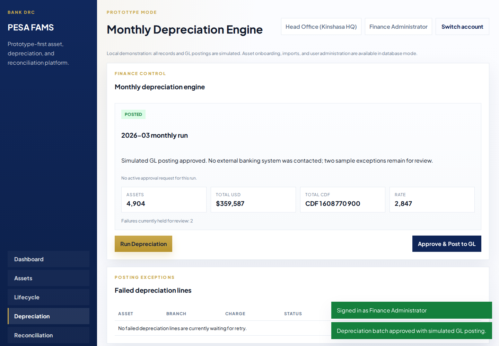
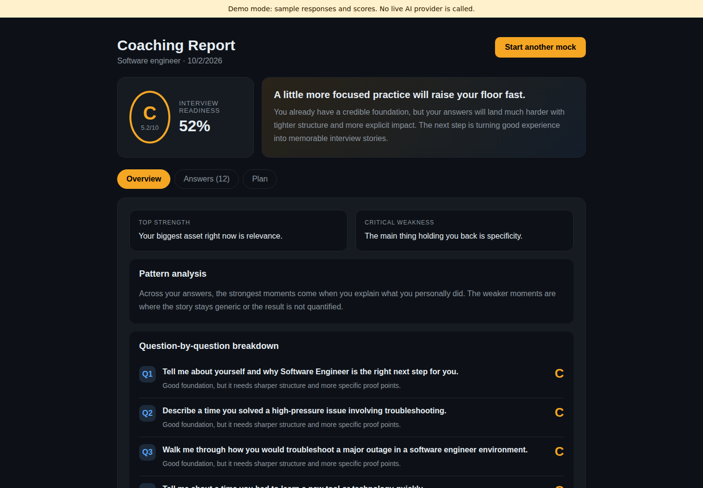
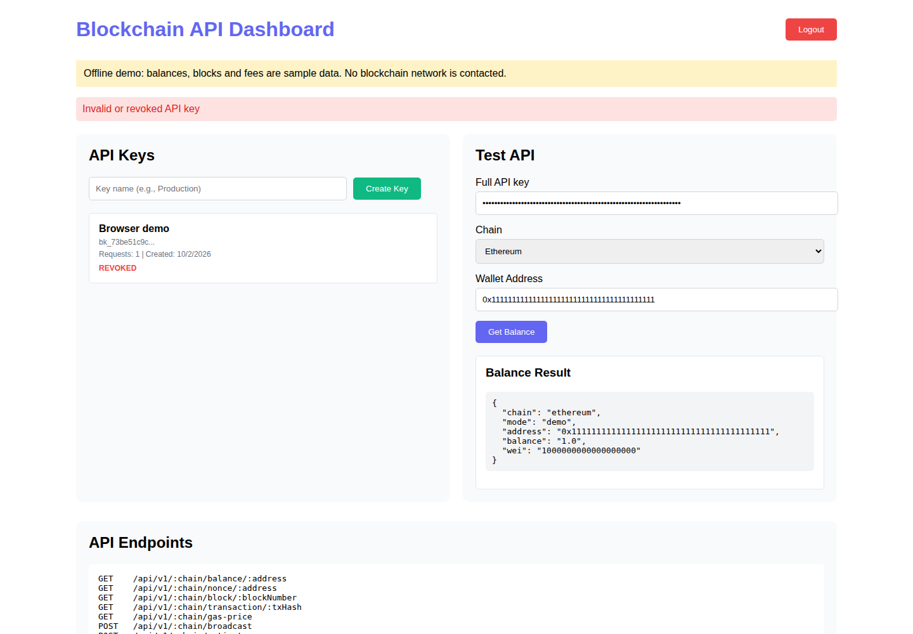
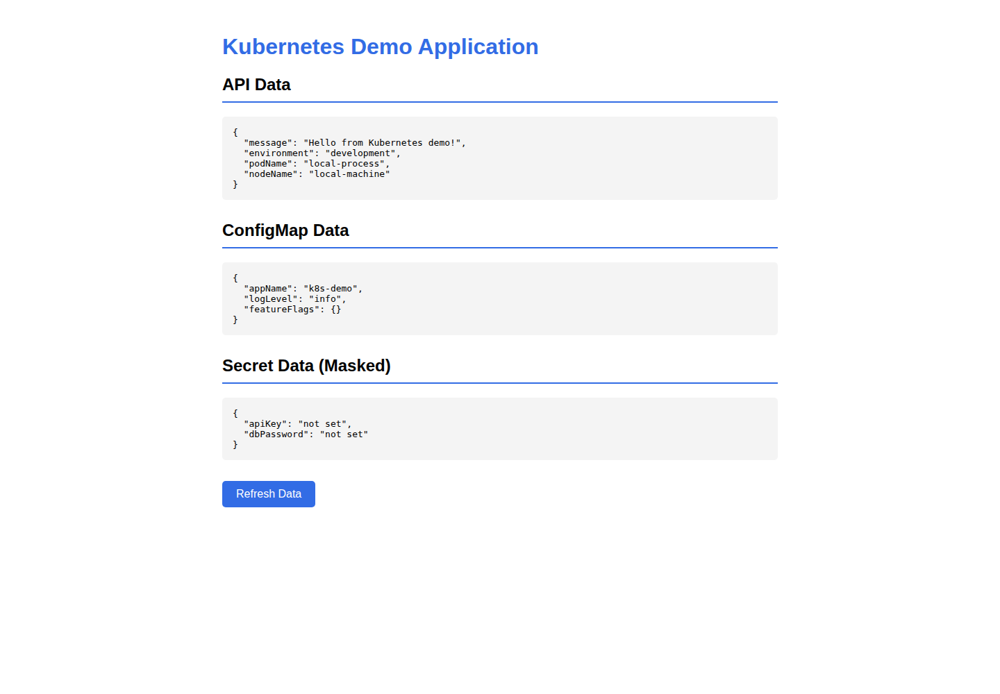
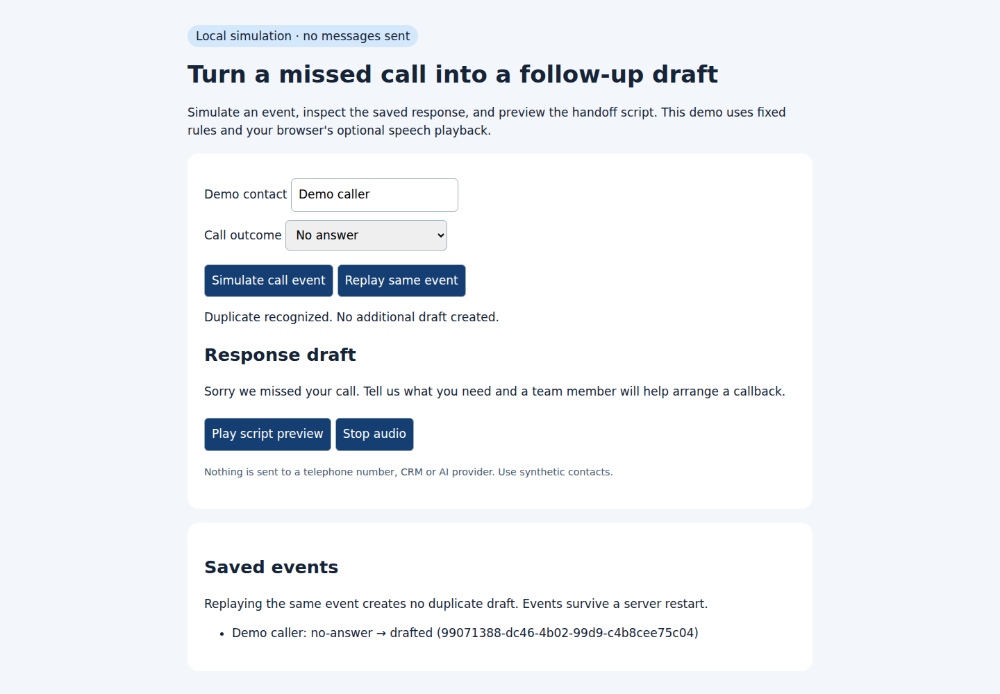

# Application walkthrough

[Portfolio](../README.md) · [Run locally](LOCAL_DEMOS.md) · [Verification evidence](VERIFICATION.md)

These screenshots were captured by the six passing browser journeys in [run 36959210255](https://github.com/tommyshamamba/SONOFGOD./actions/runs/36959210255/job/110688907645), source commit `55fd95d`. They show running applications with synthetic data. The container startup race reported by a separate job in that run was subsequently fixed with HTTP health checks; consult the current verification record for the complete workflow result.

## Trace & Store

**Workflow:** upload an image, remove its background through the actual ONNX API, download the processed PNG and update a cart that survives a page reload.

**Engineering decision:** FastAPI owns image validation and inference while the Next.js client handles preview and cart state. Required-model readiness fails explicitly if weights are unavailable; a development fallback is visibly labeled. The demo keeps checkout outside its scope.

[Source and setup](../trace-stores/) · [API implementation](../trace-stores/services/trace-api/app/main.py) · [Client tests](../trace-stores/apps/storefront/tests/)

## PESA FAMS

**Workflow:** an IT administrator prepares a sample depreciation batch; a different finance account approves it. The browser also opens an authenticated print report and verifies that an auditor cannot prepare or approve runs.

**Engineering decision:** permissions shape the visible controls, and the API independently enforces authorization and maker/checker separation. The in-memory demonstration exposes only its implemented actions. PostgreSQL mode adds persistent workflows and has separate database integration tests. GL posting in the local demonstration is simulated.

[Source and setup](../portfolio-projects/pesa-fams-banking-prototype/) · [Prototype regression tests](../portfolio-projects/pesa-fams-banking-prototype/tests/prototype.test.js) · [Database integration tests](../portfolio-projects/pesa-fams-banking-prototype/integration/database.test.js)

## Interview Nailer

**Workflow:** register, answer every question in an interview session, complete the session and reopen the saved coaching report after a refresh.

**Engineering decision:** storage supports file-based demonstrations and PostgreSQL integration, while AI behavior is selected explicitly. The test uses deterministic mock output, so a reviewer can reproduce it without provider credentials. The displayed score evaluates synthetic test answers; it is not a validated hiring assessment.

[Source and setup](../portfolio-projects/interview-nailer/) · [Backend](../portfolio-projects/interview-nailer/backend/) · [Client API configuration](../portfolio-projects/interview-nailer/frontend/src/api/base-url.mjs)

## Blockchain API Service

**Workflow:** register, create a key, query a simulated balance, revoke the key and verify that another query receives HTTP 401. The red notification shows the expected rejection.

**Engineering decision:** raw keys are returned once; storage keeps hashes. Atomic JSON snapshots and an operating-system-backed exclusive lock support a single process and recover after a forced crash. Multi-replica storage and live RPC validation are separate work.

[Source and setup](../portfolio-projects/blockchain-api-service/) · [Backend and regression tests](../portfolio-projects/blockchain-api-service/backend/)

## Kubernetes Demo

**Workflow:** the frontend reads process metadata and configuration from its API. Compose checks additionally build and start the frontend/backend images and verify proxy connectivity.

**Engineering decision:** readiness endpoints and container health checks describe service availability. Kubernetes manifests and Terraform provide deployment examples; the screenshot shows a local process, not evidence of a cluster rollout.

[Source and setup](../portfolio-projects/kubernetes-demo/) · [Deployment examples](../portfolio-projects/kubernetes-demo/k8s/) · [Terraform modules](../portfolio-projects/terraform-modules/)

## Voice missed-call simulation

**Workflow:** simulate a missed call, save its response draft, then replay the event and confirm that no second draft is created.

**Engineering decision:** SQLite persistence and event identity make duplicate handling reproducible. The local simulation sends no phone call, SMS or provider request. Optional speech preview depends on voices installed in the browser environment.

[Source and setup](../portfolio-projects/voice-ai-missed-call/) · [Local implementation and tests](../portfolio-projects/voice-ai-missed-call/demo/)
