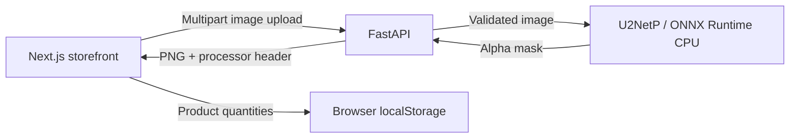

# Trace & Store

**Background removal and custom-product previews, from upload to downloadable PNG.**

Trace & Store combines a Python image API with a Next.js storefront. Upload artwork, inspect the processed result, preview it on demo products, and save product quantities in a browser cart. The API runs a pretrained U2NetP model locally on the CPU; no paid inference provider is required.

[Storefront guide](apps/storefront/README.md) · [API source](services/trace-api/app/main.py) · [Portfolio](../README.md) · [Automated checks](../.github/workflows/projects.yml)

## Implemented features

| Component | What it does |
|---|---|
| Image API | Validates uploads, runs ONNX inference, preserves existing transparency, and returns a PNG at the source dimensions after EXIF orientation. |
| Model lifecycle | Validates and warms up the model before readiness; required-model mode prevents startup when weights are unavailable or invalid. |
| Artwork workflow | Shows original and processed images, identifies the active processor, supports cancellation and download, and reports upload failures. |
| Product previews | Displays processed artwork on three illustrative products. |
| Demo cart | Adds, removes, and changes quantities; saves product quantities in browser storage. |
| Verification | API tests, frontend upload/cart tests, an optional pretrained-model smoke test, and repository CI. |

This is a working portfolio demo. Checkout, payments, order persistence, and fulfillment are not connected. Product prices are estimates; previews are not print proofs.

## Architecture



The browser calls the API directly. Image inference runs in a thread pool and is serialized by an in-process lock. The API has no database or persistent image store. Frontend preview URLs are released when replaced or unmounted, and artwork is not saved with the cart.

| Area | Source |
|---|---|
| Upload, health, and readiness endpoints | [`services/trace-api/app/main.py`](services/trace-api/app/main.py) |
| U2-Net tensor validation and CPU inference | [`services/trace-api/app/inference.py`](services/trace-api/app/inference.py) |
| Model download and checksum check | [`scripts/download_model.py`](scripts/download_model.py) |
| Creator UI and cart | [`apps/storefront/app/page.tsx`](apps/storefront/app/page.tsx) |
| Upload client and cart calculations | [`apps/storefront/lib/creator.mjs`](apps/storefront/lib/creator.mjs) |
| Local containers | [`docker-compose.yml`](docker-compose.yml) |

## Run locally

For the local setup and tests, use Python 3.12 and Node.js 24 with npm. Commands below assume `python` invokes Python 3.12. The frontend test script uses `--test-isolation=none`, supported under that flag name in Node 24; see the [Node CLI documentation](https://nodejs.org/download/release/v24.19.0/docs/api/cli.html#--test-isolationmode). The existing CI workflow still selects Node 22 and needs a runtime or test-command update. Dependency versions are recorded in the [Python requirements](services/trace-api/requirements.txt) and [frontend package manifest](apps/storefront/package.json); the frontend uses Next.js 14 and React 18.

Start each terminal at the repository root. The first setup requires internet access for dependencies and model weights.

### 1. Start the API

**Bash — macOS or Linux**

```bash
cd trace-stores
python scripts/download_model.py
export MODEL_PATH="$(pwd)/models/u2netp.onnx"
export REQUIRE_MODEL=true
cd services/trace-api
python -m venv .venv
.venv/bin/python -m pip install -r requirements.txt
.venv/bin/python -m uvicorn app.main:app --reload --host 127.0.0.1 --port 8000
```

**PowerShell — Windows**

```powershell
Set-Location trace-stores
python scripts/download_model.py
$env:MODEL_PATH = (Resolve-Path .\models\u2netp.onnx).Path
$env:REQUIRE_MODEL = "true"
Set-Location services\trace-api
python -m venv .venv
.\.venv\Scripts\python.exe -m pip install -r requirements.txt
.\.venv\Scripts\python.exe -m uvicorn app.main:app --reload --host 127.0.0.1 --port 8000
```

Open [API documentation](http://localhost:8000/docs) or [readiness status](http://localhost:8000/ready). A loaded model reports `"mode": "onnx"` and `"model_loaded": true`.

### 2. Start the storefront

In a second terminal, from the repository root; these commands work in Bash and PowerShell:

```sh
cd trace-stores/apps/storefront
npm ci
npm run dev
```

Open [the storefront](http://localhost:3000). The default API address is `http://localhost:8000`. See the [storefront guide](apps/storefront/README.md#configuration) to change it.

### Docker alternative

Docker Engine/Desktop and Compose are required. From the repository root:

```sh
cd trace-stores
python scripts/download_model.py
```

Then require the downloaded model and start the services:

```bash
# Bash
REQUIRE_MODEL=true docker compose up --build
```

```powershell
# PowerShell
$env:REQUIRE_MODEL = "true"
docker compose up --build
```

The same storefront and API URLs apply. Compose mounts `models/` read-only and starts a development storefront on Node 20. Run the documented frontend tests with local Node 24; the Compose development service does not run them. Stop services with Ctrl+C, then run `docker compose down` from `trace-stores/`.

## API and configuration

| Endpoint | Behavior |
|---|---|
| `POST /v1/remove-background` | Accepts one multipart field named `image`; returns `image/png` with an `X-Trace-Processor` header. |
| `GET /health` | Reports model name, load status, mode, and initialization error when applicable. |
| `GET /ready` | Reports readiness and active mode; required-model mode rejects unavailable models. |

Uploads must be PNG, JPEG, or WebP, no larger than 10 MiB and 16 megapixels. Unsupported content types return 415, size-limit violations return 413, invalid image content returns 422, and inference failures return 503.

| Variable | Purpose |
|---|---|
| `MODEL_PATH` | Absolute path to a compatible U2-Net/U2-NetP ONNX export. The local instructions set the downloaded `u2netp.onnx` path explicitly. |
| `REQUIRE_MODEL` | Set to `true` to require working inference. Defaults to `false`. |
| `CORS_ORIGINS` | Comma-separated browser origins permitted to call the API; defaults to `http://localhost:3000`. |
| `NEXT_PUBLIC_TRACE_API_URL` | Browser-accessible API origin, configured in the storefront. |

With `REQUIRE_MODEL=false`, missing or invalid weights select a development alpha-mask fallback that removes near-white backgrounds. Health responses and the UI identify that fallback; it does not perform learned segmentation. Failures during active model inference return an error instead of silently switching processors.

Weights are excluded from Git. The download script retrieves U2NetP from the rembg release and checks its published MD5 checksum for integrity. Review upstream dependency and model terms before redistribution or deployment.

## Verify changes

After the local API setup, use a fresh terminal at the repository root.

**Bash**

```bash
cd trace-stores/services/trace-api
.venv/bin/python -m pip install -r requirements-test.txt
.venv/bin/python -m pytest tests
# Also exercise the downloaded pretrained model:
TEST_PRETRAINED_MODEL="$(pwd)/../../models/u2netp.onnx" .venv/bin/python -m pytest tests
```

**PowerShell**

```powershell
Set-Location trace-stores\services\trace-api
.\.venv\Scripts\python.exe -m pip install -r requirements-test.txt
.\.venv\Scripts\python.exe -m pytest tests
# Also exercise the downloaded pretrained model:
$env:TEST_PRETRAINED_MODEL = (Resolve-Path ..\..\models\u2netp.onnx).Path
.\.venv\Scripts\python.exe -m pytest tests
```

The base suite uses a small executable ONNX test graph. The pretrained test is skipped unless `TEST_PRETRAINED_MODEL` is set. These checks cover execution, transparency, output dimensions, invalid inputs, and model failure handling; they do not establish segmentation accuracy or production throughput.

From `trace-stores/apps/storefront`, run `npm test` and `npm run build`. The [storefront guide](apps/storefront/README.md#verification) covers the optional live API test and browser checks. [Historical local verification](../docs/LOCAL_DEMO_VERIFICATION.md) records previous results and their limits; consult the [Actions workflow](../.github/workflows/projects.yml) for the checks configured on new changes.

## Scope and next steps

The current implementation provides synchronous CPU background removal and a browser demo cart. It does not include GPU workers, queues, user accounts, a product/order database, payment processing, or a measured capacity target.

Future work can build on this foundation:

1. Evaluate segmentation quality and measure latency with a reproducible workload.
2. Add authentication, rate limits, and an image retention policy for a hosted service.
3. Introduce object storage and a job queue if measured workloads require them.
4. Persist products and orders before connecting checkout and verified payment webhooks.

See the repository [production-readiness checklist](../docs/PRODUCTION_READINESS.md) for release evidence to collect.
